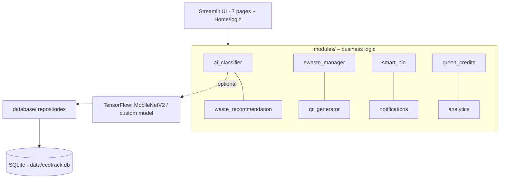

# EcoTrack AI – Architecture

## Layers
| Layer | Responsibility |
|---|---|
| `pages/`, `app.py`, `utils/ui.py` | Presentation, auth gating, role checks |
| `modules/` | Domain rules: classification, lifecycle state machine, prediction, credits |
| `database/` | SQL only – one repository per aggregate |
| `utils/` | Constants, validators, image helpers |

## Key design decisions
- **Verification before credits** – every submission is `pending` until an admin approves it; hazardous items and low-confidence predictions are explicitly flagged.
- **Ledger-based credits** – `rewards` rows are the source of truth; `users.credits` is the running balance updated in the same transaction.
- **Lifecycle state machine** – e-waste can only advance one stage at a time; handover needs recycler + destination, closure needs a certificate number; students can't advance; staff can't verify their own registrations (admins excepted).
- **Predictive alerts** – linear fit over readings since the last emptying gives *hours-to-full*; alerts are deduplicated and auto-resolve.
- **Honest AI labelling** – if TensorFlow isn't installed the colour heuristic is shown as *not AI*.

## Roles
Student (classify, register e-waste, credits) · Waste Manager (bins, e-waste lifecycle) · Campus Admin (everything + verification, users, system).
