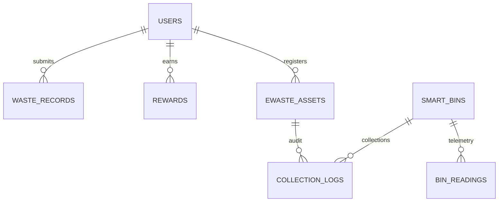

# Database schema (SQLite)

| Table | Purpose | Key columns |
|---|---|---|
| users | Accounts (PBKDF2-SHA256 hashes) | user_id, email, role, credits |
| waste_records | AI-assisted disposal submissions | category, confidence, weight_kg, status (pending/verified/rejected) |
| ewaste_assets | QR-tagged hardware | asset_id, status (6 stages), recycler_name, certificate_no |
| smart_bins | Bin registry + latest state | bin_id, category, fill_level, status, lat/lon |
| bin_readings | Sensor time-series | bin_id, fill_level, recorded_at |
| rewards | Credit ledger | user_id, points, activity, ref_type/ref_id |
| collection_logs | Audit trail for assets and bins | asset_id / bin_id, action, performed_by |
| notifications | Collection alerts | level, ref (dedupe key), is_read |
